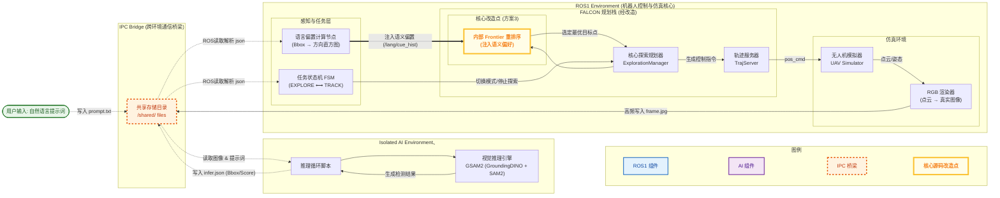

```mermaid
graph LR
    %% === 定义样式 ===
    classDef rosEnv fill:#e3f2fd,stroke:#1565c0,stroke-width:2px,color:#0d47a1;
    classDef aiEnv fill:#f3e5f5,stroke:#6a1b9a,stroke-width:2px,color:#4a148c;
    classDef ipcBridge fill:#fff3e0,stroke:#e65100,stroke-width:3px,stroke-dasharray: 5 5,color:#bf360c;
    classDef coreInnovation fill:#fffde7,stroke:#fbc02d,stroke-width:4px,color:#f57f17,font-weight:bold;
    classDef externalInput fill:#e8f5e9,stroke:#2e7d32,stroke-width:2px,color:#1b5e20;

    %% === 顶层输入 ===
    UserInput([用户输入: 自然语言提示词]):::externalInput

    %% === 左侧：ROS1 机器人环境 ===
    subgraph "ROS1 Environment (机器人控制与仿真核心)"
        direction TB
        
        subgraph "感知与任务层"
            MissionFSM["任务状态机 FSM<br/>(EXPLORE ⟷ TRACK)"]
            CueBiasNode["语言偏置计算节点<br/>(Bbox → 方向直方图)"]
        end

        subgraph "FALCON 规划栈 (经改造)"
            ExplorationManager[核心探索规划器<br/>ExplorationManager]
            
            %% 核心创新点高亮：内部注入
            subgraph "核心改造点 (方案3)"
                InternalRerank["内部 Frontier 重排序<br/>(注入语义偏好)"]:::coreInnovation
            end
            
            TrajServer[轨迹服务器<br/>TrajServer]
        end

        subgraph "仿真环境"
            UAVSim[无人机模拟器<br/>UAV Simulator]
            RGBRenderer["RGB 渲染器<br/>(点云 → 真实图像)"]
        end
    end

    %% === 中间：IPC 桥梁 ===
    subgraph "IPC Bridge (跨环境通信桥梁)"
        SharedStorage["共享存储目录<br/>/shared/ files"]:::ipcBridge
    end

    %% === 右侧：隔离 AI 环境 ===
    subgraph "Isolated AI Environment、"
        direction TB
        GSAM2Engine["视觉推理引擎<br/>GSAM2 (GroundingDINO + SAM2)"]
        InferLoop["推理循环脚本"]
    end

    %% === 链路连接关系 ===

    %% 1. 输入链路
    UserInput -.->|"写入 prompt.txt"| SharedStorage

    %% 2. 感知链路 (Sim -> AI)
    UAVSim --"点云/姿态"--> RGBRenderer
    RGBRenderer --"高频写入 frame.jpg"--> SharedStorage
    SharedStorage -.->|"读取图像 & 提示词"| InferLoop --> GSAM2Engine

    %% 3. 决策反馈链路 (AI -> ROS)
    GSAM2Engine -->|"生成检测结果"| InferLoop
    InferLoop -.->|"写入 infer.json (Bbox/Score)"| SharedStorage
    SharedStorage -.->|"ROS读取解析 json"| CueBiasNode
    SharedStorage -.->|"ROS读取解析 json"| MissionFSM

    %% 4. 核心控制闭环 (创新点)
    CueBiasNode =="注入语义偏置 (/lang/cue_hist)"==> InternalRerank
    ExplorationManager --> InternalRerank
    InternalRerank -->|"选定最优目标点"| ExplorationManager
    ExplorationManager -->|"生成控制指令"| TrajServer -->|"pos_cmd"| UAVSim

    %% 5. 任务切换
    MissionFSM --"切换模式/停止探索"--> ExplorationManager

    %% === 图例 ===
    subgraph 图例
        L1[ROS1 组件]:::rosEnv
        L2[AI 组件]:::aiEnv
        L3[IPC 桥梁]:::ipcBridge
        L4[核心源码改造点]:::coreInnovation
        L1 ~~~ L2 ~~~ L3 ~~~ L4
    end
    GSAM2Engine ~~~ L1
```